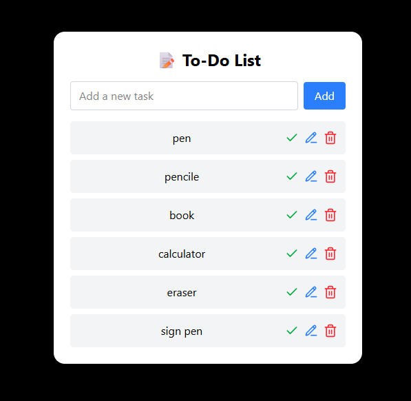

# React + Vite

# ✅ To-Do List App

A modern and responsive **To-Do List** application built with **React**, **JavaScript**, **Tailwind CSS**, and **Firebase**. Easily add, edit, and delete tasks with real-time data syncing to the cloud.

---

## 📸 Preview

---

## 🚀 Features

- ➕ Add new tasks
- 📝 Edit existing tasks
- 🗑️ Delete tasks
- 🔄 Real-time updates via Firebase Realtime Database
- 🔐 Firebase integration for secure data handling
- 💡 Responsive and minimalist UI using Tailwind CSS

---

## 🛠️ Tech Stack

- **React** – Component-based UI
- **JavaScript** – Functional logic
- **Tailwind CSS** – Utility-first CSS framework
- **Firebase** – Realtime Database for backend data storage

---

## 📁 Project Structure

TO-DO LIST APP/
├── public/
├── src/
│ ├── assets/
│ ├── components/
│ │ ├── Authentication/
│ │ └── TodoList/
│ │ └── ToDoList.jsx
│ ├── App.css
│ ├── App.jsx
│ ├── index.css
│ └── main.jsx
├── .gitignore
├── eslint.config.js
├── image.png
├── index.html
├── package-lock.json
├── package.json
├── README.md
└── vite.config.js

---

Currently, two official plugins are available:

- [@vitejs/plugin-react](https://github.com/vitejs/vite-plugin-react/blob/main/packages/plugin-react) uses [Babel](https://babeljs.io/) for Fast Refresh
- [@vitejs/plugin-react-swc](https://github.com/vitejs/vite-plugin-react/blob/main/packages/plugin-react-swc) uses [SWC](https://swc.rs/) for Fast Refresh

## Expanding the ESLint configuration

If you are developing a production application, we recommend using TypeScript with type-aware lint rules enabled. Check out the [TS template](https://github.com/vitejs/vite/tree/main/packages/create-vite/template-react-ts) for information on how to integrate TypeScript and [`typescript-eslint`](https://typescript-eslint.io) in your project.
